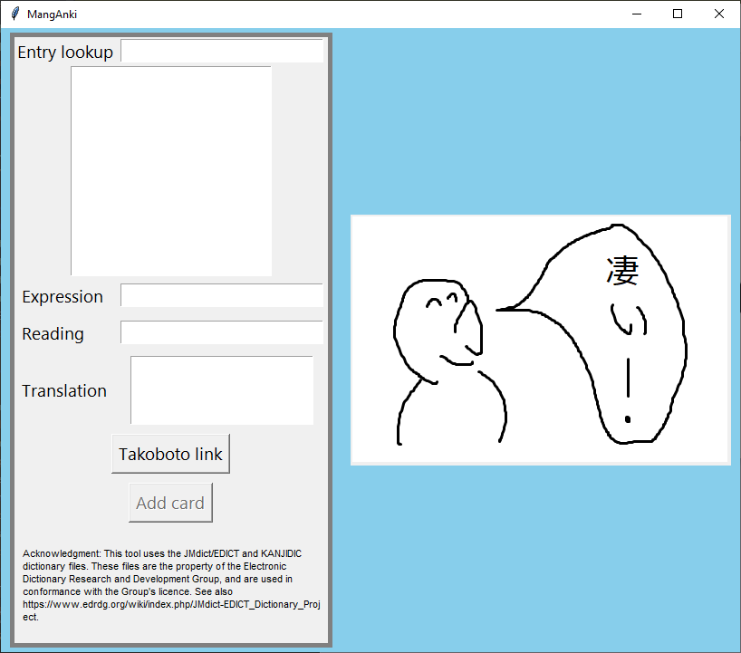
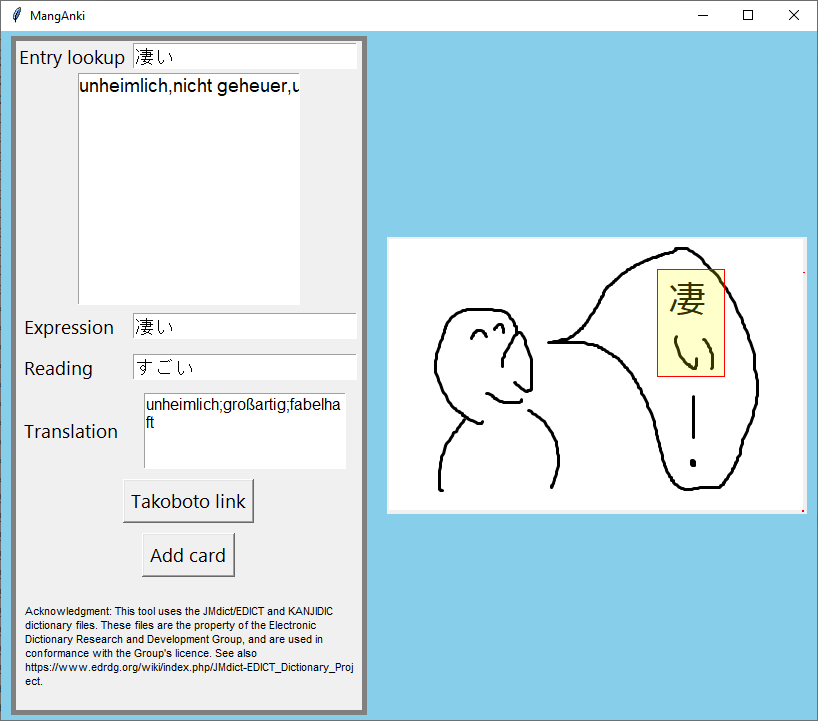

# MangAnki (まんがんき)

MangAnki is a simple Python-based tool to create flash cards for Japanese words and sentences from online media
like web mangas or animes for [Anki](https://apps.ankiweb.net/), a popular SRS tool.

The generated cards have an image containing a japanese sentence on the front page,
and the meaning of one of the words in the sentence as back side of the card. 
Images copied into the system clipboard (e.g. using the Windows cutting tool) are automatically
imported into the tool, an unknown word in the image can be marked, and a dictionary 
lookup can be performed to obtain meaning and writing, and also a link to the popular 
online dictionary [takoboto](https://apps.takoboto.jp/). The GUI is written using Python's `tkinter` framework.

# Acknowledgment
This tool uses the JMdict/EDICT and KANJIDIC dictionary files. These files are the property of the Electronic Dictionary Research and Development Group, and are used in conformance with the Group's licence. See also [JMDICT](https://www.edrdg.org/wiki/index.php/JMdict-EDICT_Dictionary_Project )

# Beware
This program modifies your Anki data. No responsibility is given for potential damages and problems due to software bugs etc. See also license.

# Installation 

## Required tools and packages
- Anki >= 23.10.01
- Python >=3.9

Please perform 
    
    pip install -r requirements.txt

to install the necessary python dependencies, especially `anki` and `pillow`.

## Starting the tool

You can start the tool by using `python manganki.py options`:

    usage: manganki.py [-h] --collection_path COLLECTION_PATH --media_path
                MEDIA_PATH [--jdict_file_path JDICT_FILE_PATH]
                [--preferred_language {eng,ger}] [--deck_name DECK_NAME]


You have to provide
- required: the path to your ANKI collection path using `--collection_path`, e.g. `--collection_path "C:\Users\fritz\AppData\Roaming\Anki2\User 1\collection.anki2"`)
- required: the path to your ANKI media collection using `--media_path`, e.g. `--media_path`, e.g. `--media_path "C:\Users\fritz\AppData\Roaming\Anki2\User 1\collection.media"`)
- optional: name of your deck using `--deck_name`, e.g. `Mangas` (default is `MangAnki`)
- optional: preferred language for dictionary lookup using `--preferred_language` (currently `eng` or `ger`, default is `eng`) 
- optional: path to a dictionary file in JDict format using `--jdict_file_path` (a default file is already bundled with the tool) 

It might be a good idea to write a small batch file containing the parameters.

## How to use it
Manganki uses Anki notes of type `MangAnki`. If no such note type is present yet, it is created automatically.
Here is how to add cards after starting the program:

- Copy a picture to the clipboard - it should appear on the right side of the MangAnki window:



- Mark the word you want to generate a card for on the right using the mouse (left-click and drag a rectangle)


- Enter the word in he entry lookup field, hopefully the word is found (use base forms for verbs and adjectives)

- If required change translation, expression and reading fields



- Click on ```Add card```. This should send the card to the specified deck. You are ready for the next image.


## Known problems
- There seem to be possible race conditions in connection with the clipboard on Windows systems.