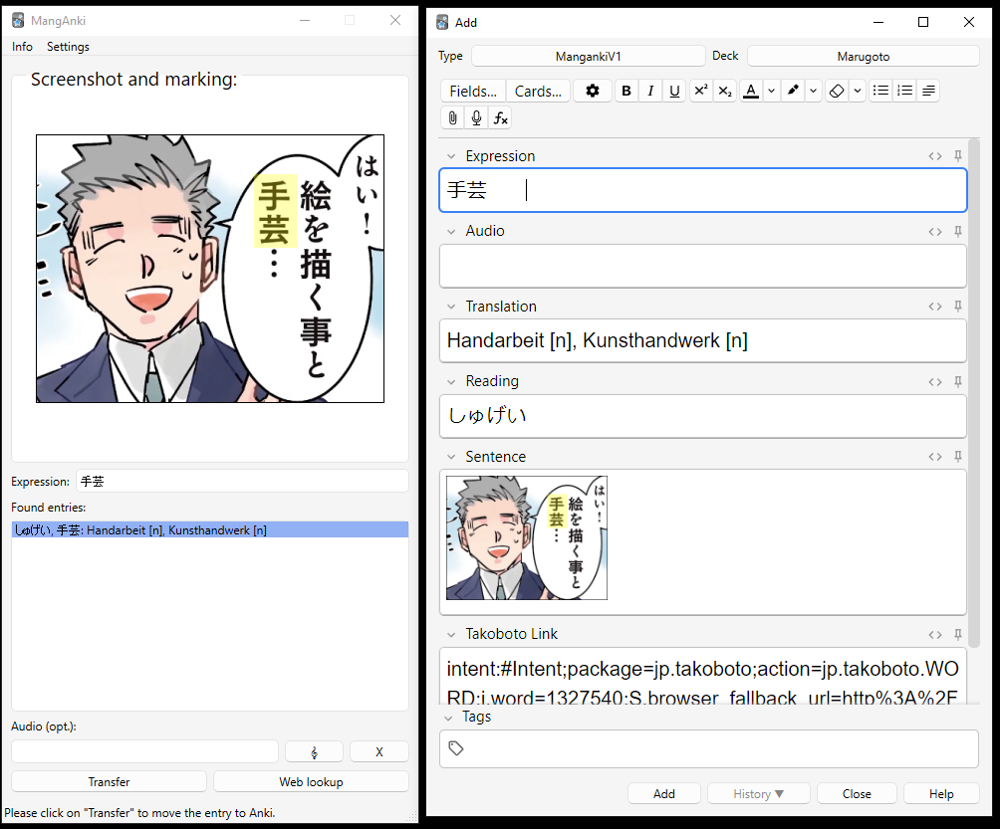

# MangAnki (まんがんき)

MangAnki is a simple add-on for  [Anki](https://apps.ankiweb.net/), a popular SRS tool,
to create flash cards for Japanese words and sentences from online media. 
It has been written for making vocabulary mining easier when reading mangas online. 
It allows to process screenshots of manga excerpts and includes a dictionary lookup. It creates cards
from screenshot excerpts and dictionary entries; the cards contain a link to the word entry in Takoboto,
a popular Japanese dictionary, providing more information and phrases.

The generated cards have an image containing a Japanese sentence on the front page,
and the meaning of one of the words in the sentence on the back side.
Images copied into the system clipboard (e.g. using the Windows Snipping tool) are automatically
imported into the tool, an unknown word in the image can be marked, and a dictionary 
lookup can be performed to obtain meaning and writing, and also a link to the popular 
online dictionary [takoboto](https://apps.takoboto.jp/). 

# Acknowledgments
- MangAnki uses the JMdict/EDICT and KANJIDIC dictionary files. These files are the property of the Electronic Dictionary Research and Development Group, and are used in conformance with the Group's licence. See also [JMDICT](https://www.edrdg.org/wiki/index.php/JMdict-EDICT_Dictionary_Project )
- MangAnki uses the handy JSON export files from <a href=https://github.com/scriptin/jmdict-simplified>jmdict-simplified</a>.
- MangAnki uses the wonderful <a href="https://takoboto.jp/">Takoboto</a> dictionary, by providing weblinks to Takoboto entries on the cards and within the plugin itself.
# Beware
This program modifies your Anki data. No responsibility is given for potential damages and problems due to software bugs etc. See also license.

## Using the Add-On

### Installation
You can download the add-on from the <a href="https://ankiweb.net/shared/addons">Anki website</a> (look for the
code in the entry for MangAnki there).

### Using MangAnki
Once installed, you can access it via the tools menu in Anki:

## How to use it

The example screenshots are taken using the online manga <a href="https://www.youtube.com/watch?v=DpwSxJGKFjk&list=PLykz7wyOAW7iiQV6nUZiH0b-eHN_wQWqm">実録 保育士でこ先生</a>, provided on Youtube bei KADOKAWA/Kitora.

Manganki uses Anki notes of type `MangAnkiV1`. If no such note type is present yet, it is created automatically.
Here is how to add cards after starting the addon:
### Copy a picture (screenshot)
Copy a picture containing a sentence with an unknown Japanese word to the clipboard. 
This can be most easily done using the Snipping tools provided by e.g. Windows or most Linux versions (most of the time by pressing "Print"). The picture should
appear in the field "Screenshot and Marking".

### Mark the word you like to create the card for
The picture should appear in MangAnki. Now mark the word you are interested in *in* the picture, by left-clicking in the picture and drawing a rectangle.

### Enter the unknown word
Now enter the word you are looking for into the "Expression" field. Please use either purely Kana writing or correct Kanji writing. 
Future versions will also consider e.g. different verb forms, or try to extract the word automatically via OCR.
If the dictionary knows the word, one or more entries appear in the box under "Found entries". You can change the preferred language of the dictionary
using the combo box on top of MangAnki,

### Choose a translation and transfer

Select one of the translations. 
You can get more info about the translation entry by clicking on "Web lookup" (opens a browser window pointing to Takoboto's entry for this word).
You can also specify a Tag for your Anki deck. 
Then click "Transfer". If not yet open, the "Add" dialogue of Anki should open and the infos of the card should be displayed. You can edit 
the entry (e.g. remove unwanted readings / meanings) and then add the new card to your deck (make sure that it is added to the correct deck!

## TODOS:
- Dictionary loading at the beginning is slow - maybe use an SQLite database
- Support of sound files e.g. for Anime mining
- OCR for words
- Possibly tighter integration into Anki (originally, it was planned as a standalone tool)
